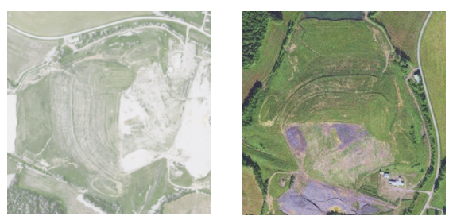
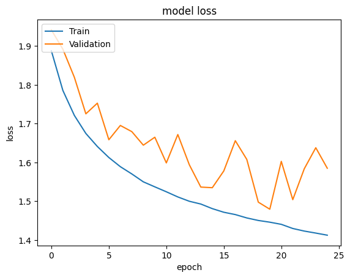
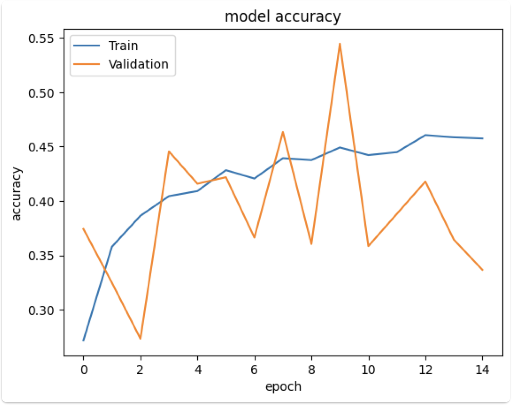
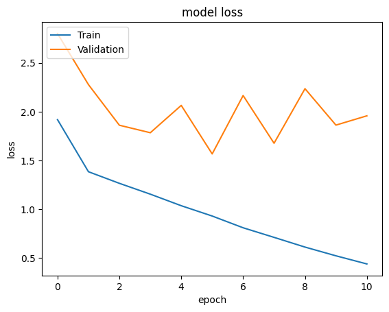
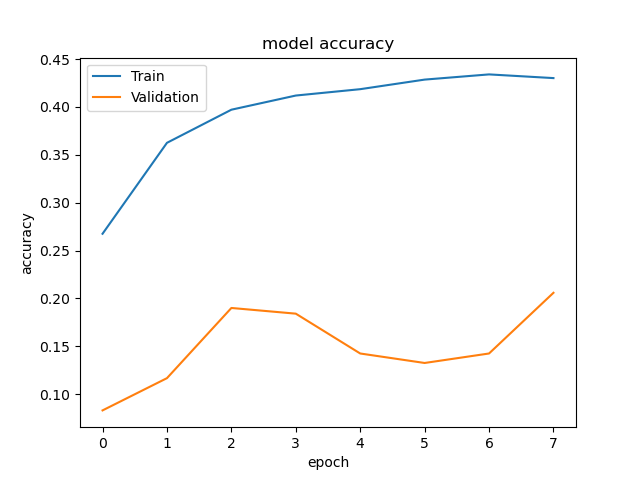
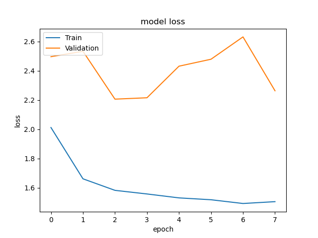
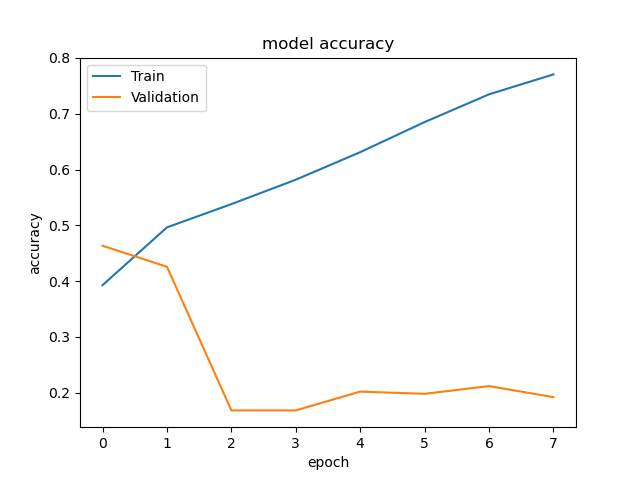
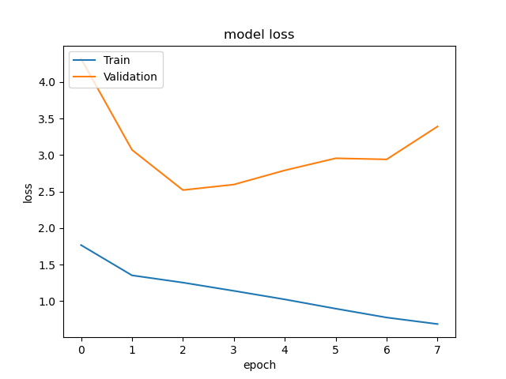

# Multi Class Satellite Image Classification Using CNNs For Methane Emitting Facility Tracking

Machine learning approaches can be used to map methane emissions to their sources and thus the contribution to global warming as suggested by Zhu et al. (2022). Therefore, this project aims to use deep learning techniques to classify satellite images into seven categories – Concentrated Animal Feeding Operations (CAFOs), Landfills, Mines, Negative, Processing Plants, Refineries & Terminals, WW Treatment – using a dataset with over 86,000 satellite images (Zhu et al., 2022). This is done by implementing and training Convolutional Neural Networks (CNNs), as well as using pre-trained models with transfer learning and fine-tuning.

## Data 
### Description
The used dataset initially was created to support building a global database of methane emitting infrastructure called Methane Tracking Emissions Reference (METER). This dataset contributes to the tracking of emitted volumes to their sources. It contains a total of 86,599 georeferenced images from the US labeled for the presence or absence of any of the six possible methane emitting facilities. The majority class is “Negative” with 34,195 instances, while the minority, with least instances of 1,706, is “Mines”. Some labels occur significantly more often than others – therefore it is considered an imbalanced dataset. To address the imbalance in the dataset, a hybrid technique consisting of two steps is applied: Undersampling majority classes and Oversampling minority classes. After the balancing the training dataset consists of 2,000 instances for each label and therefore is perfectly balanced with a total of 14,000 images.

### Balancing
Too little data for a certain class, may hinder the model’s knowledge development to identify this pattern, which would result in a low accuracy. Therefore, it was aimed to achieve a balanced dataset of 2,000 images in each category. The methods applied are a combination of geometric transformations, color space transformations,and noise injections. 

  
   
  Figure 1: Original image vs. augmented image

## Model Choice
### Alexnet
The baseline model used is the AlexNet CNN architecture, which consists of five convolutional layer, three max pooling and three fully connected layers. 
### ResNet
To add a next layer of complexity, ResNet-50 was chosen , as it yields an even higher accuracy on the ImageNet Dataset than the AlexNet. First, the ResNet model was used for transfer learning by importing the pre-trained model provided by Keras and adding a fully connected layer, which was trained on the training samples. In a second step, fine-tuning was used additional, by unfreezing the last convolution block and re-trained with the training sample (this model is further called "ResNet50 + FT"). 
### VGG16
To add a next layer of complexity, a self- implemented VGG16 model was used. The model consists of 13 Convolution layers, five Max Pooling Layers and three Dense Layers. Thus, in total it has 16 layers with weights. Compared to state-of-the-arts models like GoogLeNet or MSRA the VGG16 provided better results in the ImageNet Large-Scale Visual Recognition Challenge (ILSVRC), making it well suitable for other image classification problems.

## Training
Combining insights of the accurracy and loss graphs of the training help to determine the model’s behavior with respect to under- and overfitting. 

### AlexNet Training Accuracy and Loss
<table>
  <tr>
    <td></td>
    <td></td>
  </tr>
</table>

### Resnet base Training Accuracy and Loss
<table>
  <tr>
    <td></td>
    <td></td>
  </tr>
</table>

AlexNet, the least complex model, exhibits a decrease in the loss function for both training and validation, while the accuracy function increases over the course of the epochs. As the model shows a constantly higher loss and lower accuracy for the validation set the model might potentially overfit. 

### ResNet50 Training Accuracy and Loss 
#### ResNet50 Transfer Learning 

<table>
  <tr>
    <td></td>
    <td></td>
  </tr>
</table>

#### ResNet50 + FT

<table>
  <tr>
    <td></td>
    <td></td>
  </tr>
</table>

ResNet50 and ResNet50 + FT, show a more complex patter in the loss and accuracy functions. For ResNet50, both functions for the train set seem to be well behaved as they slowly converge at the end of the training. However, on the validation loss and accuracy fluctuate and do not clearly converge.
ResNet50 + FT does not exhibit good model behavior, as training loss and accuracy do not converge, and there is a significant difference between the learning functions for the training and validation sets, indicating potential overfitting.

## Evaluation
For evaluation of the models at hand, in this project Precision, Recall, F-score, and accuracy values are used:

### Precision
$$\text{Precision} = \frac{TP}{TP + FP}$$

- Precision describes the rate of correct decisions for every “positive” decision made.

### Recall
$$\text{Recall} = \frac{TP}{TP + FN}$$

- Recall however, shows at what rate the model identifies Positives from actual Positive instances in the dataset.

### F1 Score
$$F1 = 2 \times \frac{\text{Precision} \times \text{Recall}}{\text{Precision} + \text{Recall}}$$

- The F1-score of a model is the harmonic mean of the according Precision and Recall scores, which are trade-off values: aiming for an increase of the one, in tendency, leads to a decrease of the other.

### The implemented models provide following metrics

| Model          | Accuracy | Precision | Recall | F1    |
|----------------|----------|-----------|--------|-------|
| AlexNet        | 0.414    | 0.358     | 0.414  | 0.406 |
| ResNet         | 0.467    | 0.508     | 0.461  | 0.453 |
| ResNet + FT    | 0.572    | 0.492     | 0.444  | 0.438 |

As can be seen, all models are better than random results, which would equal to an accuracy of 0.143 (100/7). Based on the above metrics, xxx emerges as the best model overall. It has the highest values across all the key performance metrics. This suggests that xxx is the most balanced and effective model among those compared, providing better generalization and performance on the data. Notably, the xxx model outperforms both the ResNet50 and the ResNet50 + FT, even though the ResNet models are pretrained on the large ImageNet dataset.

This might seem counterintuitive at first. However, the specific nature of satellite data and the unique classes represented in the chosen dataset are likely to be underrepresented in the ImageNet as it typically contains classes like mammals, birds, fish. 

Moreover, a pre-trained model may perform not as good on new data especially when classes share similar visual characteristics, which is shown later at the example of Mines and Landfills. Consequently, transfer learning with ResNet50, even with fine-tuning, does not yield better results than training a xxx model from scratch on the specific dataset.

