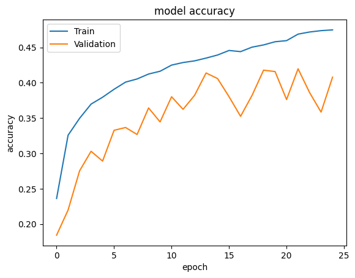
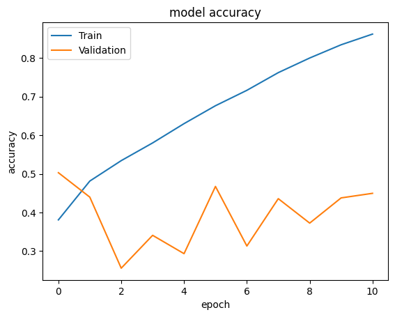

# Multi Class Satellite Image Classification Using CNNs For Methane Emitting Facility Tracking

Machine learning approaches can be used to map methane emissions to their sources and thus the contribution to global warming. Therefore, this project aims to use deep learning techniques to classify satellite images into seven categories – Concentrated Animal Feeding Operations (CAFOs), Landfills, Mines, Negative, Processing Plants, Refineries & Terminals, WW Treatment – using a dataset with over 86,000 satellite images. This is done by implementing and training Convolutional Neural Networks (CNNs), as well as using pre-trained models with transfer learning and fine-tuning.\
\
The Dataset can be retrieved from this source: https://stanfordmlgroup.github.io/projects/meter-ml/#:~:text=METER%2DML%20consists%20of%2086%2C625,Plants)%2C%20oil%20refineries%20and%20petroleum

## Data 
### Description
The used dataset initially was created to support building a global database of methane emitting infrastructure called Methane Tracking Emissions Reference (METER). This dataset contributes to the tracking of emitted volumes to their sources. It contains a total of 86,599 georeferenced images from the US labeled for the presence or absence of any of the six possible methane emitting facilities. The majority class is “Negative” with 34,195 instances, while the minority, with least instances of 1,706, is “Mines”. Some labels occur significantly more often than others – therefore it is considered an imbalanced dataset. To address the imbalance in the dataset, a hybrid technique consisting of two steps is applied: Undersampling majority classes and Oversampling minority classes. After the balancing the training dataset consists of 2,000 instances for each label and therefore is perfectly balanced with a total of 14,000 images.

### Balancing
Too little data for a certain class, may hinder the model’s knowledge development to identify this pattern, which would result in a low accuracy. Therefore, it was aimed to achieve a balanced dataset of 2,000 images in each category. The methods applied are a combination of geometric transformations, color space transformations,and noise injections.\

  
   
  Original image vs. augmented image

## Model Choice
### Alexnet
The baseline model used is the AlexNet CNN architecture, which consists of five convolutional layer, three max pooling and three fully connected layers. 
### ResNet
To add a next layer of complexity, ResNet-50 was chosen , as it yields an even higher accuracy on the ImageNet Dataset than the AlexNet. First, the ResNet model was used for transfer learning by importing the pre-trained model provided by Keras and adding a fully connected layer, which was trained on the training samples. In a second step, fine-tuning was used additional, by unfreezing the last convolution block and re-trained with the training sample (this model is further called "ResNet50 + FT"). 
### VGG16
To add a next layer of complexity, a self- implemented VGG16 model was used. The model consists of 13 Convolution layers, five Max Pooling Layers and three Dense Layers. Thus, in total it has 16 layers with weights. Compared to state-of-the-arts models like GoogLeNet or MSRA the VGG16 provided better results in the ImageNet Large-Scale Visual Recognition Challenge (ILSVRC), making it well suitable for other image classification problems.

## Training
For this project different learning rates were chosen to optimize the accuracy of each model. Compared to the other models, the VGG16 was implemented with a smaller size of epochs, to limit the runtime of the model. Combining insights of the accurracy and loss graphs of the training help to determine the model’s behavior with respect to under- and overfitting. 

  
| Model      | Epochs | Learning Rate | Batch Size |
|------------|--------|---------------|------------|
| ResNet     | 30     | 0.0001        | 128        |
| ResNet + FT| 30     | 0.00001       | 128        |
| AlexNet    | 30     | 0.000001      | 128        |
| VGG16      | 15     | 0.00001       | 128        |

Table 1: Training Hyperparameter

  

### Alexnet Training Accuracy and Loss

     

AlexNet, the least complex model, exhibits a decrease in the loss function for both training and validation, while the accuracy function increases over the course of the epochs. As the model shows a constantly higher loss and lower accuracy for the validation set the model might potentially overfit. 

### Resnet Base Training Accuracy and Loss

   

For ResNet50 with Transfer Learning, both functions for the train set seem to be well behaved as they slowly converge at the end of the training. However, on the validation loss and accuracy fluctuate and do not clearly converge.

### Resnet Fine Tuning Training Accuracy and Loss

   

On the other hand, ResNet50 + FT does not exhibit good model behavior, as training loss and accuracy do not converge, and there is a significant difference between the learning functions for the training and validation sets, indicating potential overfitting.

### VGG16 Training Accuracy and Loss

   

Similar to the Alexnet, the VGG16 exhibits a decrease in the loss function for both training and validation, while the accuracy function increases over the course of the epochs. However, in the beginning of the training run, the model seems to perform better on the new data, and the potential overfitting seems to start at epoch three.

## Evaluation
For evaluation of the models at hand, in this project Precision, Recall, F-score, and accuracy values are used:

### Precision
$$\text{Precision} = \frac{TP}{TP + FP}$$

- Precision describes the rate of correct decisions for every “positive” decision made.

### Recall
$$\text{Recall} = \frac{TP}{TP + FN}$$

- Recall however, shows at what rate the model identifies Positives from actual Positive instances in the dataset.

### F1 Score
$$F1 = 2 \times \frac{\text{Precision} \times \text{Recall}}{\text{Precision} + \text{Recall}}$$

- The F1-score of a model is the harmonic mean of the according Precision and Recall scores, which are trade-off values: aiming for an increase of the one, in tendency, leads to a decrease of the other.

### The implemented models provide following metrics

| Model          | Accuracy | Precision | Recall | F1    |
|----------------|----------|-----------|--------|-------|
| AlexNet        | 0.414    | 0.467     | 0.414  | 0.406 |
| ResNet         | 0.358    | 0.508     | 0.461  | 0.453 |
| ResNet + FT    | 0.444    | 0.492     | 0.444  | 0.438 |
| VGG16          | 0.461    | 0.572     | 0.461  | 0.453 |

Table 2: Evaluation Metrices

As can be seen, all models are better than random results, which would equal to an accuracy of 0.143 (100/7). Based on the above metrics, xxx emerges as the best model overall. It has the highest values across all the key performance metrics. This suggests that xxx is the most balanced and effective model among those compared, providing better generalization and performance on the data. Notably, the xxx model outperforms both the ResNet50 and the ResNet50 + FT, even though the ResNet models are pretrained on the large ImageNet dataset.

This might seem counterintuitive at first. However, the specific nature of satellite data and the unique classes represented in the chosen dataset are likely to be underrepresented in the ImageNet as it typically contains classes like mammals, birds, fish. 

Moreover, a pre-trained model may perform not as good on new data especially when classes share similar visual characteristics, which is shown later at the example of Mines and Landfills. Consequently, transfer learning with ResNet50, even with fine-tuning, does not yield better results than training a xxx model from scratch on the specific dataset.

## Deep Dive VGG16
Diving deeper into the results of the VGG16, the following table represents the evaluation metrics across the different classes:

| Class             | Precision | Recall | F1   | Support |
|-------------------|-----------|--------|------|---------|
| CAFOs             | 0.85      | 0.66   | 0.74 | 118     |
| Landfills         | 0.27      | 0.38   | 0.32 | 69      |
| Mines             | 0.83      | 0.25   | 0.38 | 238     |
| Negative          | 0.38      | 0.83   | 0.52 | 194     |
| ProcessingPlants  | 0.26      | 0.44   | 0.33 | 63      |
| R&T               | 0.60      | 0.43   | 0.50 | 131     |
| WWTreatment       | 0.46      | 0.28   | 0.35 | 177     |

Table 2: Evaluation metrices acreoos caategories for VGG16

The performance of the VGG16 varies significantly across different facility types. It performs well in identifying CAFOs and has high precision for mines but struggles with recall. On the other side, it performs poorly in identifying landfills and processing plants. High precision but low recall for "Mines" means the model is accurate in its positive predictions but not effective in identifying all true positive instances. This might be due to the varying appearance of mines, as can be seen followingly.

  
   
   Correct and wrong "Mine" predictions

On the other hand, high recall but low precision for "Landfills" means the model is effective at identifying most of the true landfill instances but is not very accurate, as it misclassifies many non-landfill instances as landfills.

  
   
   Correct and wrong "Landfills" predictions

In this case, both landfills and mines can appear as large, open areas with minimal or some vegetation and without structural appearances. This may make it hard for models to predict the right class.

## Grad-CAM Analysis
Understanding why the model predicts a given outcome is a crucial detail for model users and a necessary diagnostic to ensure the model makes decisions based on the correct information contained in the input. The performance of the best performing model VGG16 was analyzed using a Grad CAM model.

  
   
   Grad-CAM Images

The figure displays two images from the dataset and its respective heatmaps from the Grad-CAM model. From these exemplary images it can be derived that our model focuses on facilities and streets present in the images. This means that the model makes its classification predictions based on these characteristics. However, this also indicates that it might be more difficult for the model to predict classes if these features are not present (e.g., landfills or mines).

## Conclusion
This study investigated deep learning techniques in classifying satellite images of methane- emitting facilities, highlighting the need for accurate environmental monitoring. By comparing the CNN models AlexNet, VGG16, ResNet50 and ResNet50 + FT, this project found VGG16 to be the most robust model for this task. The data preprocessing addressed dataset imbalances, and data augmentation techniques aim to enhance the models' ability to learn robust features. Despite VGG16's success, challenges in classifying facilities with similar visual characteristics indicate a need for integration of additional data sources or utilizing more complex models.
